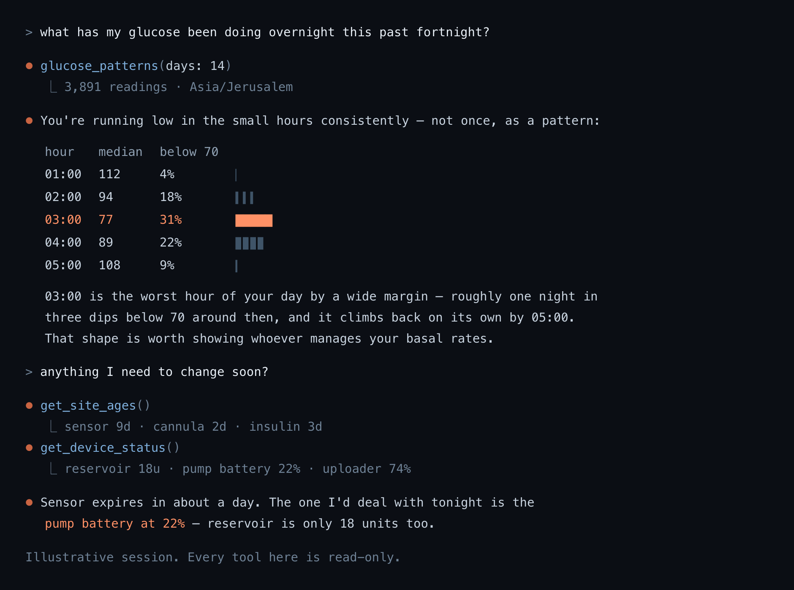

# nightscout-mcp

**Ask Claude about your Nightscout CGM data.** Read-only — it cannot change
anything in Nightscout.



> **Not a medical device.** Don't make treatment decisions from it. Readings can
> be stale, missing or wrong, and an LLM can misread them.
>
> *(Illustrative session — invented numbers.)*

## Setup

**1. Make a read-only Nightscout token.** Admin Tools → Subjects → Add, with the
`readable` role only. **Not your `API_SECRET`** — nothing here writes, so giving
it write access buys nothing and costs everything if it leaks.

**2. Configure and run.**

```bash
cp .env.example .env      # NS_URL, NS_TOKEN, MCP_BEARER
docker build -t nightscout-mcp . && docker run -d --env-file .env -p 8787:8787 nightscout-mcp
```

`MCP_BEARER` is required — the server refuses to start without one. Generate it
with `python3 -c "import secrets; print(secrets.token_urlsafe(32))"`.

Put it behind HTTPS (Traefik, Caddy, Cloudflare Tunnel — anything). Claude
connects from Anthropic's servers, not your device, so the URL must be publicly
reachable.

**3. Connect a client.**

*Claude* (web, desktop, mobile) — Customize → Connectors → Add custom connector:

| field | value |
|---|---|
| URL | `https://your-host.example.com/mcp` |
| header | `authorization` |
| value | `Bearer <MCP_BEARER>` |

Type `Bearer ` including the space — Claude sends the value verbatim.

*Claude Code:*

```bash
claude mcp add --transport http nightscout https://your-host.example.com/mcp \
  --header "Authorization: Bearer <MCP_BEARER>"
```

*Anything else* — standard streamable-HTTP MCP. `/mcp` plus an
`Authorization: Bearer …` header. Nothing here is Claude-specific.

## Tools

| Tool | Returns |
|---|---|
| `get_current_glucose` | Latest reading, trend, and how old it is |
| `get_recent_glucose` | Readings over the last N hours |
| `time_in_range` | Low / in-range / high split, average, GMI, CV |
| `glucose_patterns` | Glucose by hour of day — *when* you run low or high |
| `glucose_dashboard` | The same, as an interactive chart where supported |
| `compare_periods` | The last N days against the N before |
| `get_recent_treatments` | Boluses, carbs, site changes |
| `get_insulin_on_board` | Active insulin and carbs on board |
| `get_device_status` | Pump reservoir and battery, uploader, loop health |
| `get_site_ages` | Age of cannula, sensor, insulin, pump battery |
| `get_profile` | Basal rates, ISF, carb ratio, targets |
| `server_status` | Nightscout version and thresholds |

`glucose_patterns` is the one worth knowing about: "what is my glucose" is
already on a screen, but "what time of day do I reliably go low" needs two weeks
of readings and someone willing to count. Hours are binned in your Nightscout
profile's timezone.

Nightscout's bolus wizard (`bwp`) is **deliberately not exposed** — it returns a
suggested insulin dose, which would make this something that advises treatment
rather than shows data. Every tool here is a read.

## Security

Read-only by construction: there is no write path, so a total compromise of this
server still cannot change your Nightscout. It reads with a least-privilege
token, requires a bearer (constant-time compare) or refuses to start, keeps that
token out of error messages, trusts `X-Forwarded-*` only from proxies you name
in `TRUSTED_PROXY_IPS`, and runs as a non-root user. `/health` is the one open
route and returns a fixed `{"ok": true}`.

## Notes

`NS_UNITS=mg/dl` (default) or `mmol` — display only; Nightscout is always read in
mg/dL.

Not affiliated with the Nightscout Foundation. Nightscout is AGPL-3.0; this
contains none of its code and only calls its REST API, so that copyleft doesn't
extend here.

MIT — see [LICENSE](LICENSE).
